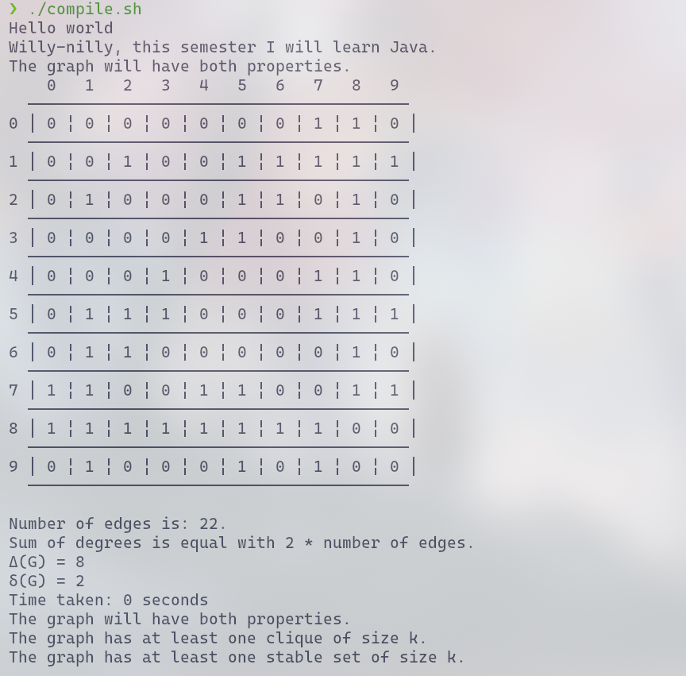
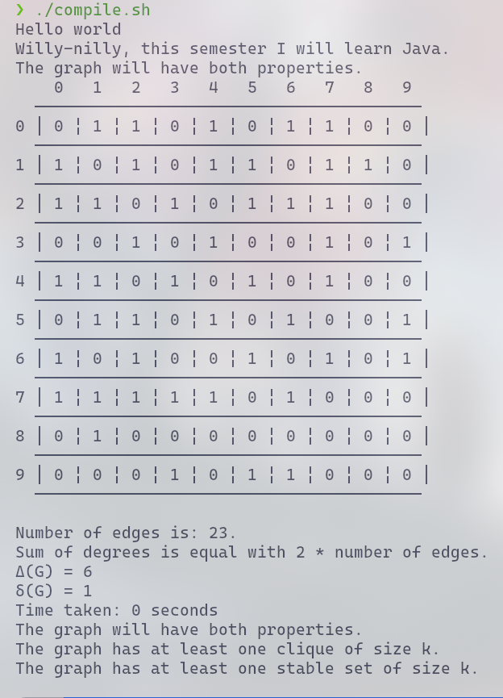
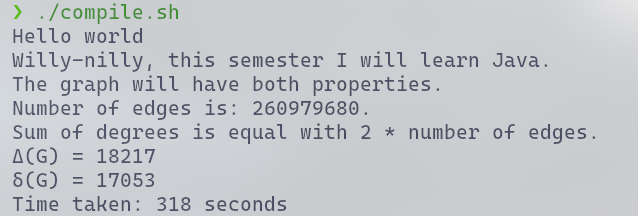
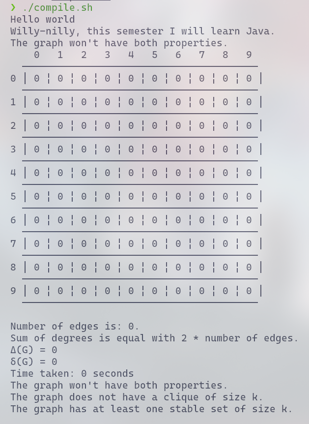

### Homework
A k-clique: a set of vertices that induces a complete graph of size k. (Noted: w(G))  
A stable set: is s subset of G where is no edge between its vertices. (Noted: alpha(G))  

The dependecy beetween clique and stable set: w(G) = alpha(G'), G' = the complementary graph of G.  

A graph G with n vertices can have in the same time a k-clique and a stable set of size k only if:  
 k <= n / 2 + 1, if k is odd  
 k <= n / 2, otherwise

 If k is equal to n / 2 + 1 or n / 2, then one vertex must be included in both k-clique and stable set.

 Generating random graph:
 - if both properties can be checked:
   1) choose k random vertices and build a k-clique;  
   2) choose k vertices (at most 1 vertex from k-clique) and form a stable set;  
   3) generate other random edges without breaking the stable set;  
 - if it can't: just generate random edges;  

Number of edges: sum of the values from the adjacency matrix, where i < j, i = row, j = colomn.   
Maximum and the minimum degree of a vertex: maximum and minimum sum from adjaceny matrix from every row.  

I made a bash script to compile all java files in terminal.  

### Bonus
For finding a clique of at least size k I used the recursive algorithm [Bron–Kerbosch](https://en.wikipedia.org/wiki/Bron%E2%80%93Kerbosch_algorithm) . I modified it to stop after finding a clique of size k.  

How it works: "The recursion is initiated by setting R and X to be the empty set and P to be the vertex set of the graph. Within each recursive call, the algorithm considers the vertices in P in turn; if there are no such vertices, it either reports R as a maximal clique (if X is empty), or backtracks. For each vertex v chosen from P, it makes a recursive call in which v is added to R and in which P and X are restricted to the neighbor set N(v) of v, which finds and reports all clique extensions of R that contain v. Then, it moves v from P to X to exclude it from consideration in future cliques and continues with the next vertex in P."  

In other words: the algorithm checks every vertex, that was not in a previous verified not optimal clique, if it can form a clique with other unvisited vertices.  

To check if a graph has a stable set of size at least k I used the property w(G) = alpha(G'). If the algorithm described above find a k-clique in graph G' it means that G has a stable set of size k.  

  
  
  
  

Documentation:
- Graph Algorithms courses from first semester
- Advance Programming slides
- https://en.wikipedia.org/wiki/Bron%E2%80%93Kerbosch_algorithm
- https://www.geeksforgeeks.org/
- https://docs.oracle.com/en/java/
  

      
